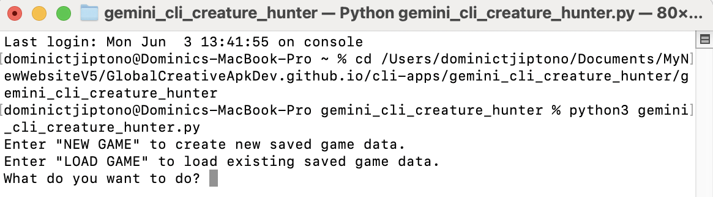
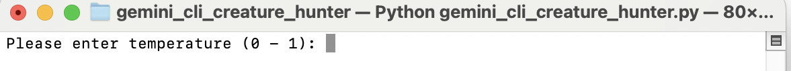
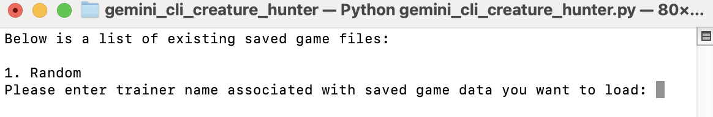
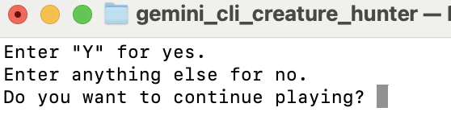
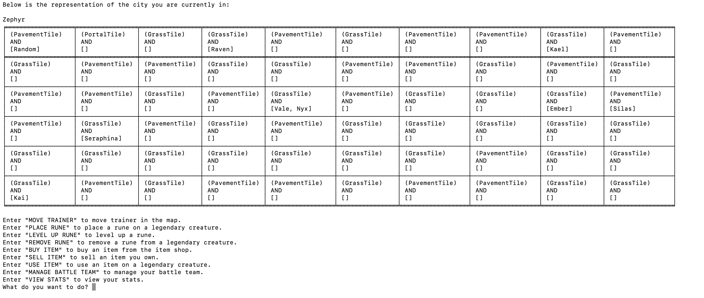

# gemini_cli_creature_hunter

**Gemini CLI Creature Hunter** is a Pokemon-like game on command-line interface with Google Gemini AI 
integrated into it.

# Source Code

The source code of the game **Gemini CLI Creature Hunter** is available in 
[Source Code](https://github.com/GlobalCreativeApkDev/GlobalCreativeApkDev.github.io/blob/main/cli-apps/gemini_cli_creature_hunter/gemini_cli_creature_hunter/gemini_cli_creature_hunter.py).

# Installation

```
pip install gemini_cli_creature_hunter
```

# How to Play the Game?

Pre-requisites:

1. [Python](https://www.python.org/downloads/) installed in your device.
2. env file in the same directory as <GEMINI_CLI_CREATURE_HUNTER_DIRECTORY> and has the value of GEMINI_API_KEY.
3. The directory "saved" exists inside the directory <GEMINI_CLI_CREATURE_HUNTER_DIRECTORY>. 
Please create the "saved" directory if it has not existed in <GEMINI_CLI_CREATURE_HUNTER_DIRECTORY> directory yet.

First, open a Terminal or Command Prompt window and run the following commands.

```
cd <GEMINI_CLI_CREATURE_HUNTER_DIRECTORY>
python3 gemini_cli_creature_hunter.py
```

**Note:** Replace <GEMINI_CLI_CREATURE_HUNTER_DIRECTORY> with the path to the directory of the game 
**Gemini CLI Creature Hunter**.

Then, the game will start with something looking like in the screenshot below.



You have two choices:

1. Enter "NEW GAME" to create new saved game data.
2. Enter "LOAD GAME" to load existing saved game data.

# New Saved Game Data Creation

The following happens if you choose to create new saved game data.



You will then be asked to input the following values.

1. Temperature - between 0 and 1 inclusive
2. Top P - between 0 and 1 inclusive
3. Top K - at least 1
4. Max output tokens - at least 1
5. Your name to be used as your trainer's name

You will then be directed to the main menu.

# Loading Existing Saved Game Data

You will only be able to load existing saved game data if at least one or more saved game 
files are stored inside the "saved" directory.

The following happens when you choose to load existing saved game data.



You will then be asked to enter the name of the trainer associated with the existing saved game data you want to load.
After that, your saved game data will be loaded and you will be directed to the main menu.

# Main Menu

Once you reach the main menu, you will be asked whether you want to continue playing the game or not. If you enter 'Y', 
you will be directed to choose an action. Else, your game data will be saved and you will exit the game.



# Action Choice

Once you entered 'Y' when you were at the main menu, you will be redirected to action choice. At the top of the 
command-line window, you will see the map of the city you are in (together with your current location). Below 
the map, you will see the available actions you can choose to do. Battles against wild legendary creatures or trainers 
might occur if you enter "MOVE TRAINER" and then select the direction you want to move to.



Then, you will need to follow the instructions on the screen, for whichever action you choose to do.
